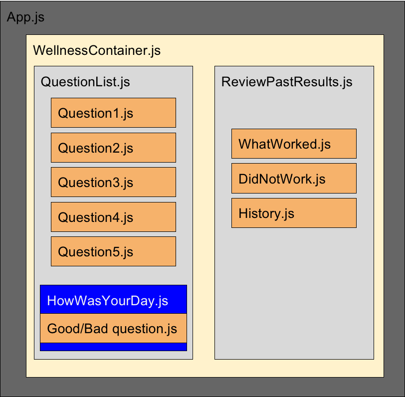

</img>

# The Wellness Tracker
> Track your wellbeing every day with 5 simple questions, and work out the leading cause of your best (or worst) days.

Our wellbeing app is aimed towards individuals who want to track their wellness in 5 major areas.

- Social
- Diet
- Sleep
- Mental
- Physical

The app asks basic questions which map to a score between 1-6. Each of those answers is then evaluated to determine what made the users day good/bad. 
The user can then look for trends to learn what are the positive and negative influences in their life.

## Live Version
http://www.amiwell.club

Hosting Configuration:
- Docker with Docker Compose
- Nginx
- Digital Ocean VPS
- Ubuntu 18.04

## Technology Used

- Java Spring Boot Backend
- H2 Database
- React Frontend
- Google Charts

## MVP

Ask the user questions to do with 5 aspects of their life on that day; sleeping, eating, social, mental and physical.

Ask the user for their answers for the day before unless it is past 5PM.

User is presented with a visual way to understand what they did on their best and worst days.

### Database Layout

### User Stories during planning

As a user I want to:

- score my day based on 5 basic questions
- input a reason comment for a good day or bad day
- view top reason comments over time
- answer questions one at a time, in a step-by-step way
- answer questions for the day before if before 5PM

### React Components Planned

### React Components Final

